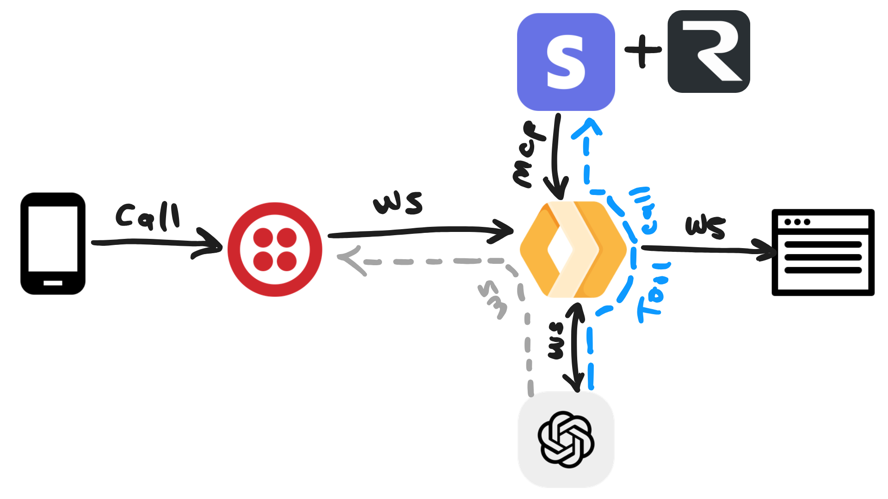

# Stripe Store Agent

A serverless agent that acts as a Stripe store sales assistant, leveraging OpenAI and Stripe APIs to handle customer requests via text or audio. Customers can connect to the agent via a phone call using Twilio. The agent can search documentation, manage customers, handle payments, and send emails, all through tool calls. It support sending out emails through Resend.

[](https://deploy.workers.cloudflare.com/?url=https://github.com/megaconfidence/stripe-store-agent)

## Features



- Real-time conversational agent (text/audio) using OpenAI GPT-4o.
- Connect to the agent via a phone call using Twilio.
- Integrates with Stripe for store/customer/payment management.
- Supports tool calls for Stripe operations and documentation search.
- Email sending via Resend API.
- Deployable as a Cloudflare Worker.

## Getting Started

### Deployment

1. **Clone the repository:**

   ```bash
   git clone https://github.com/megaconfidence/stripe-store-agent.git
   cd stripe-store-agent
   ```

2. Install dependencies:

   ```bash
   npm install
   ```

3. Set environment variables in `.dev.vars`:
   - `OPENAI_API_KEY`
   - `STRIPE_API_KEY`
   - `RESEND_API_KEY`
   - `RESEND_FROM_EMAIL`

4. Deploy to Cloudflare and take note of the app domain:

   ```bash
   npm run deploy
   ```
5. Buy a [Twilio phone number](https://www.twilio.com/en-us/phone-numbers), select the number > Configure > A call comes in, and set the method to post and url to:
	```
 	https://replace_with_your_app_domain_here/incoming-call
 	``` 

## Local Dev

Local dev is a bit tricky as you'll need to set up a [Cloudflare Tunnel](https://developers.cloudflare.com/cloudflare-one/connections/connect-networks/) or [Ngrok](https://ngrok.com/docs/getting-started/) to expose your local server to the internet. After which you'll update the Twilio webhook url from step 5. Then your call to your Twilio number should establish a websocket connection to the local server, and everything should work as expected.

To start the local server run:
```bash
npm run dev
```
